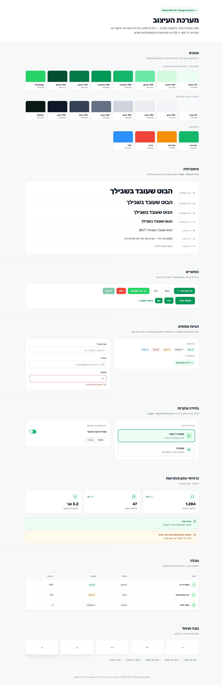
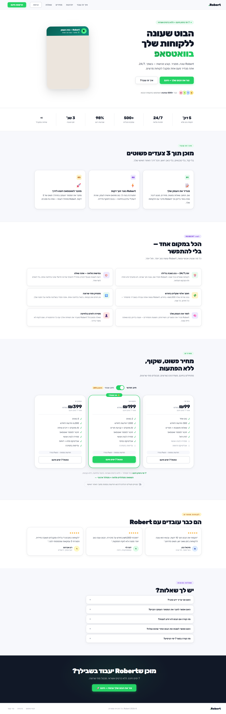
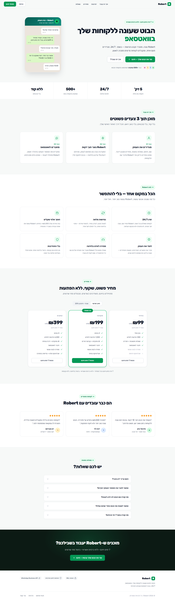
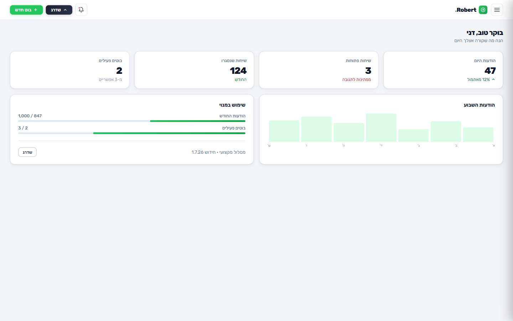
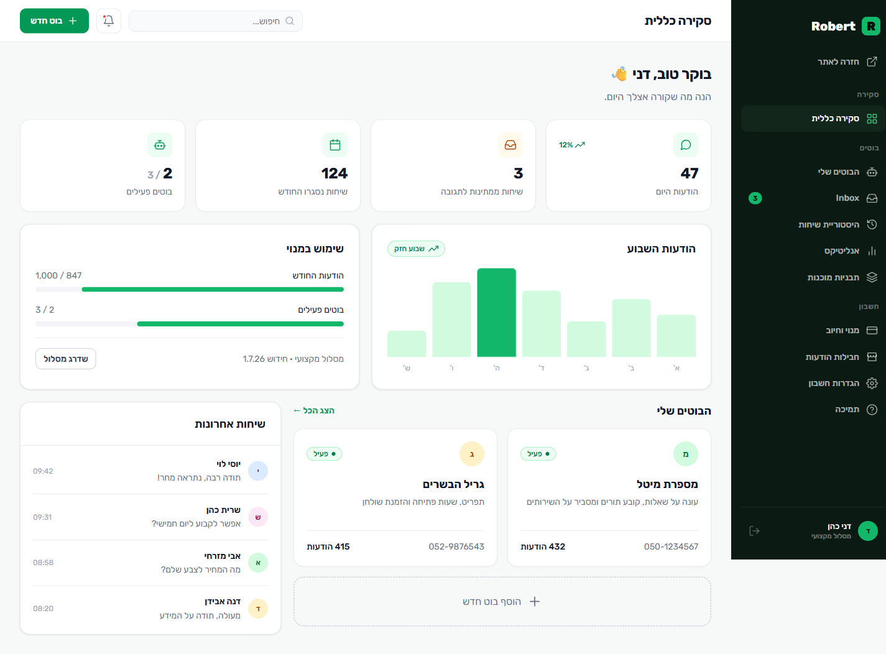
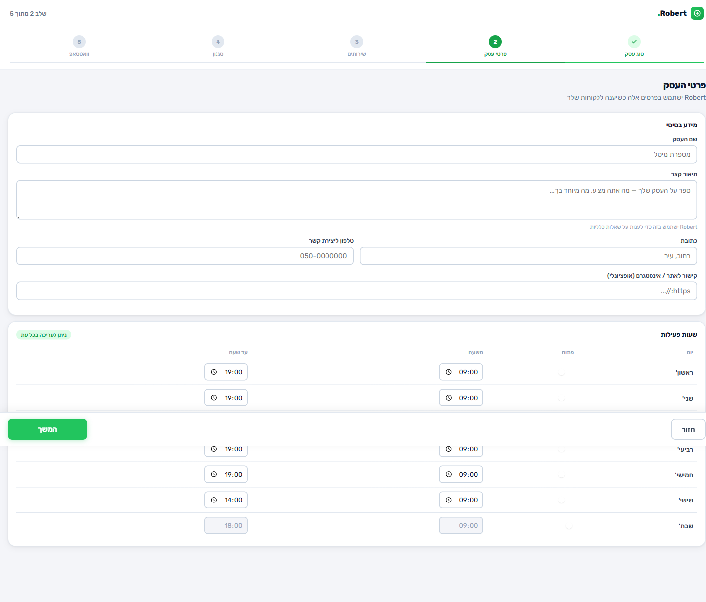
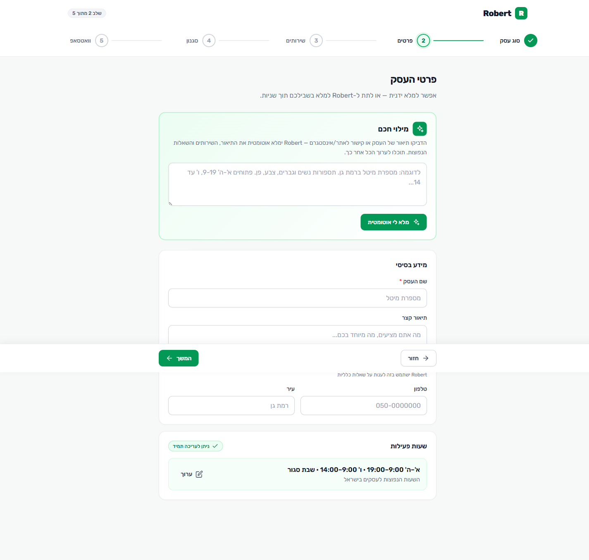

# RobertBot V2 — Redesign מלא · מצגת לאישור 🎨

> מעבדת עיצוב מבודדת. **אפס שינוי במערכת הקיימת.** כל הקבצים סטטיים, נפתחים בדפדפן.
> זוהי הצעה לאישור — לא הטמעה.

---

## 1. Executive Summary

ביצענו Redesign מלא בהשראת עקרונות ה-UX והאמינות של **Green Invoice** (לימוד, לא העתקה).
המוצר הקיים עובד, אבל סובל מ**"סימני דמו"** שיטתיים שמורידים אמון. ב-V2 בנינו **מערכת
עיצוב אחת, מזוקקת ובוגרת**, והוכחנו אותה על 3 מסכי-דגל + ספר מותג חי.

**מה הוכן (Round 1):**
- 🎨 מערכת עיצוב מלאה — `tokens.css` + `lab.css` + `design-system.html`
- 🏠 דף בית V2 · 🧙 אונבורדינג V2 (עם מילוי חכם ב-AI) · 📊 דשבורד V2 (app shell מלא)
- 📄 אודיט מוצר + מחקר Green Invoice + מסע משתמש חדש
- 📸 צילומי Before/After

**הקפיצה המרכזית:** מ"עוד מוצר AI" → ל-SaaS עסקי בוגר שמשלמים עליו.

---

## 2. UX Findings (תמצית האודיט)

| ממצא | חומרה | הסבר |
|---|---|---|
| אמוג'י כאייקונים בכל המוצר (📝⚡🚀💇) | 🔴 | הסימן #1 ל"פרויקט צד/MVP" — ולא עקבי בין מערכות הפעלה |
| ריבוי צבעים שובב (תגיות ירוק/סגול/כתום/צהוב) | 🟠 | חוסר משמעת ויזואלית, מבזר תשומת לב |
| ירוק WhatsApp צעקני `#25D366` כצבע ראשי | 🟠 | בהיר/רווי מדי לתחושת פרימיום |
| Social proof מנופח ("98%", "∞", אווטארי-אות) | 🟠 | פוגע באמון במקום לבנות אותו |
| חוסר עקביות טוקנים בין עמודים | 🟠 | כל עמוד = פלטה/רקע/רדיוס משלו → אין מערכת |
| חיכוך גבוה באונבורדינג | 🟠 | טבלת שעות מלאה + הקלדה ידנית; "10 דק'" לא ממומש |

מסמכים מלאים: [audit/01-product-audit.md](audit/01-product-audit.md) ·
[audit/research/greeninvoice.md](audit/research/greeninvoice.md) ·
[audit/02-ux-rebuild.md](audit/02-ux-rebuild.md)

---

## 3. Design Decisions (7 העקרונות)

1. **משמעת צבע** — ירוק ליבה אחד מזוקק (`#039855`/`#12b76a`) + ניטרלים עשירים; WhatsApp
   ירוק נשמר רק ל"חבר וואטסאפ"; סמנטיקה (אדום/כתום/כחול) רק לסטטוסים.
2. **אייקוני-קו עקביים** (lucide-style SVG sprite) במקום אמוג'י — הקפיצה הכי גדולה לאמינות.
3. **טיפוגרפיה הדוקה** — סולם display→text אחיד, בלי gradient-text/אפקטים על כותרות.
4. **White-space נדיב** — סקשן = רעיון אחד; פחות צפיפות.
5. **CTA ראשי אחד** עקבי בכל מסך.
6. **Social proof אמין** — מספרי-עוגן מדודים, עדויות עם שם+עסק+עיר, אותות אמון בפוטר.
7. **הסרת חיכוך** — מילוי חכם ב-AI + שעות בפריסט; "אישור" במקום "הקלדה".

---

## 4. New Design System

מקור אמת אחד לכל המסכים:
- **צבע:** סקאלת ירוק 25→900 + סקאלת ניטרל gray 25→900 + סמנטיקה.
- **טיפוגרפיה:** Rubik · display-2xl→xs · text-xl→xs · משקלים 400–800 · כללי מובייל.
- **טוקנים:** spacing (4px base), radius (6→20px+full), elevation (xs→2xl), ease.
- **קומפוננטות:** buttons · inputs/fields · cards · badges · eyebrow · choice tiles ·
  toggle · segment · tabs · table · avatar · alerts · stat-cards · steps · sidebar · topbar.

חי וניתן לצפייה: **[design-system.html](design-system.html)**

---

## 5. Before vs After

### דף הבית
| לפני | אחרי |
|---|---|
|  |  |

אמוג'י→אייקוני-קו · תגיות מרובות-צבע→מבטא ירוק אחד · gradient-text→כותרת נקייה ·
מספרים מנופחים→אמינים · אותות אמון בפוטר.

### דשבורד
| לפני | אחרי |
|---|---|
|  |  |

ללא sidebar קבוע→**sidebar כהה קבוע ומקובץ** · כרטיסי-נתון עם אייקונים+דלתא ·
גרף מודגש · רשת בוטים עם סטטוסים · רשימת שיחות אחרונות.

### אונבורדינג
| לפני | אחרי |
|---|---|
|  |  |

טבלת שעות מלאה→**פריסט חכם** · הקלדה ידנית→**כרטיס מילוי חכם ב-AI** · אמוג'י→אריחי-קו ·
progress steps נקי. (signup: [before](audit/before/onboarding-signup.png) · [after](audit/after/onboarding-signup.png))

---

## 6. Benefits

- **אמון ובגרות** — נראה ומרגיש כמו SaaS שמשלמים עליו (כמו Green Invoice/Stripe/Monday).
- **עקביות** — מערכת אחת = פיתוח מהיר יותר, פחות באגים ויזואליים, מותג חזק.
- **המרה** — CTA ברור, פחות חיכוך באונבורדינג → יותר בוטים שמגיעים ל"go-live".
- **מימוש ההבטחה** — "בוט תוך 10 דקות" סוף-סוף אמיתי, דרך מילוי חכם (סוכן הידע הקיים).
- **תחזוקה** — טוקנים + קומפוננטות משותפות מקלים על כל שינוי עתידי.

---

## 7. Risks

- **שינוי ויזואלי גדול** — משתמשים קיימים יראו מוצר שונה; כדאי תקשורת/changelog.
- **RTL + מובייל** — נבנה RTL-first ורספונסיבי, אך דורש QA על מכשירים אמיתיים בהטמעה.
- **המרה לסטאק** — הפרוטוטייפ הוא HTML/CSS; ההטמעה היא ל-CSS Modules של Next (ראה למטה).
- **תוכן אמין** — להחליף עדויות/מספרים בנתונים אמיתיים לפני פרסום (לא להמציא).
- **אינטגרציית AI באונבורדינג** — חיבור ל-`POST /api/agents/knowledge` (קיים) דורש בדיקה.

---

## 8. Migration Complexity (להערכה בלבד — לא להטמעה עכשיו)

| רכיב | מורכבות | הערה |
|---|---|---|
| טוקנים → `globals.css` | 🟢 נמוכה | מיפוי משתני CSS חדשים; תואם לארכיטקטורה הקיימת |
| קומפוננטות → CSS Modules | 🟡 בינונית | תרגום `lab.css` ל-`scoped()` per-component |
| דף בית (CMS) | 🟠 גבוהה | הבית מונע מ-`SectionRenderer`; דורש עדכון רכיבי הסקשנים |
| אונבורדינג + AI prefill | 🟡 בינונית | חיווט ל-knowledge agent הקיים + state |
| דשבורד shell | 🟡 בינונית | sidebar/topbar חדשים סביב התוכן הקיים |
| שאר המסכים (Round 2) | 🟡 בינונית | login/billing/settings/admin באותה שפה |

**המלצה:** הטמעה הדרגתית — קודם טוקנים+קומפוננטות, ואז מסך-מסך (לא Big Bang).

---

## 9. הצעד הבא

1. **אישור השפה העיצובית** (Round 1) — אם מאושר, נרחיב ל-Round 2: כל שאר המסכים
   (login · register · verify · bots · integrations · billing · settings · admin).
2. **הטמעה לפרודקשן** — מתחילה **רק** לאחר שתקליד את המשפט המדויק:

   ### `APPROVED FOR IMPLEMENTATION`

עד אז — המערכת הקיימת לא נגעת בה. הכול כאן הוא הצעה בלבד.
